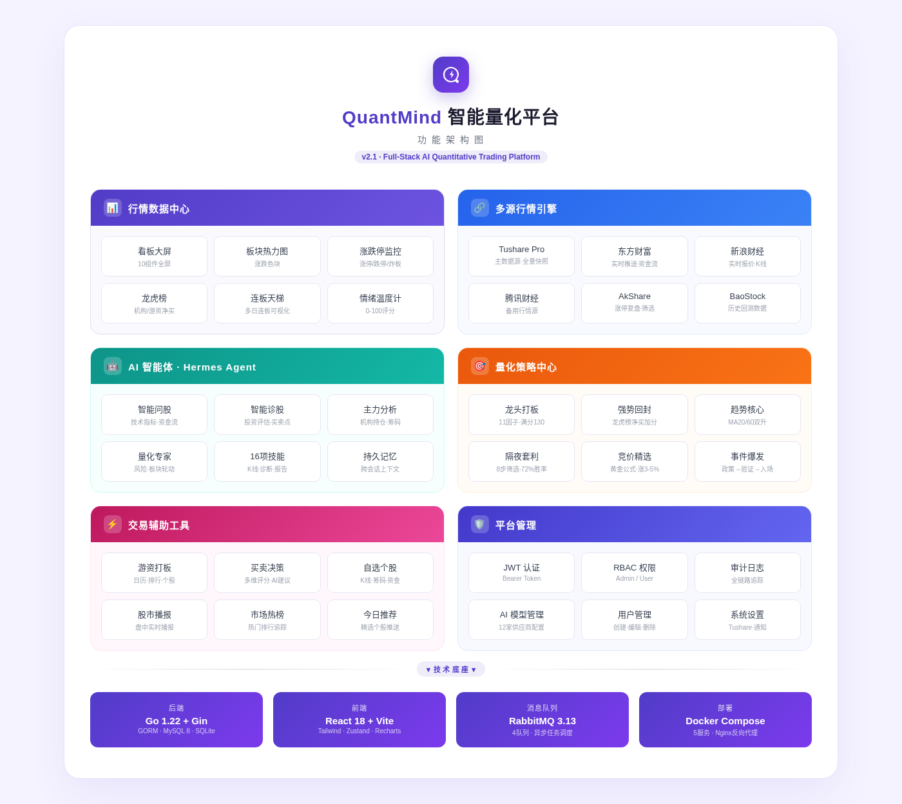
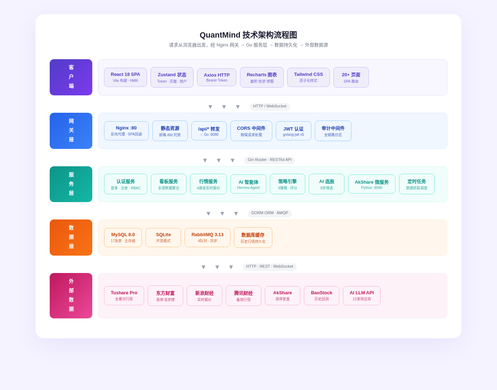
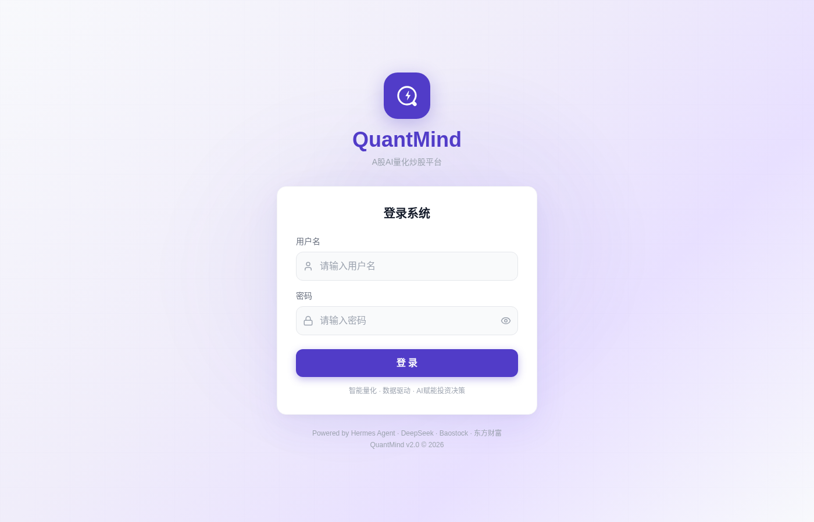

<p align="center">
  
</p>

<h1 align="center">QuantMind</h1>

<p align="center">
  <strong>A股 AI 量化交易平台</strong><br/>
  <sub>基于 Hermes Agent 架构 · 多源实时行情 · 9 套量化策略 · 全栈一键部署</sub>
</p>

<p align="center">
  <a href="https://go.dev"></a>
  <a href="https://react.dev"></a>
  <a href="https://www.mysql.com"></a>
  <a href="https://www.rabbitmq.com"></a>
  <a href="https://www.docker.com"></a>
</p>

<p align="center">
  <a href="#快速开始">快速开始</a> ·
  <a href="#功能架构">功能架构</a> ·
  <a href="#页面预览">页面预览</a> ·
  <a href="#api-接口文档">API 文档</a> ·
  <a href="#部署运维">部署运维</a> ·
  <a href="LICENSE">MIT License</a>
</p>

---

## 项目简介

**QuantMind** 是一套面向中国 A 股市场的全栈 AI 量化交易平台，专为个人量化交易者和小团队设计。平台集成了 **6 大行情数据源**、**9 套量化策略**、**4 个 AI 智能体**，以及 **20+ 现代化前端页面** —— 全部通过一条 `docker-compose up` 命令即可完成部署。

### 核心亮点

| 特性 | 说明 |
|------|------|
| **多源行情引擎** | Tushare / 东方财富 / 新浪 / 腾讯 / AkShare / BaoStock，自动回退保障数据可用性 |
| **AI 智能体** | 4 个基于 Hermes Agent 协议的专业智能体，支持 16 项技能和工具调用 |
| **量化策略** | 9 套循证策略，含完整评分体系和阈值规则，附数据来源文档 |
| **隔夜套利** | 8 步自动化筛选流程，72% 目标胜率，每日实时数据驱动 |
| **全屏看板** | 10 组件数据大屏，支持 7 日历史导航，板块热力 / 涨停 / 龙虎榜 / 情绪一览 |
| **零代码配置** | 所有参数（策略阈值、AI 模型、Tushare Token）均通过 UI 配置 |
| **一键部署** | Docker Compose 编排 5 个服务，单命令生产级部署 |

### 设计原则

```
1. UI 驱动配置 —— 无需手动修改后端代码
2. 数据真实性 —— 每一个指标、标签、阈值均来源于外部真实数据
3. 循证策略 —— 策略阈值基于已论证的技术分析标准
4. AI 可溯源 —— 智能体回答必须引用具体数据来源和分析体系
5. 多源冗余 —— Tushare → 东方财富 → 缓存 → 历史，确保任何情况下不返回空数据
```

---

## 功能架构

### 功能架构总览

> 六大功能模块覆盖行情数据、AI 智能体、量化策略、交易工具和平台管理全链路。

<p align="center">
  
</p>

### 技术架构流程图

> 请求从浏览器出发，经 Nginx 网关 → Go 服务层 → 数据持久化 → 外部数据源，五层清晰架构。

<p align="center">
  
</p>

### 数据流向优先级

```
┌─────────────────────────────────────────────────────────────────────────┐
│  Tushare daily (全量快照)                                                │
│      ↓ 失败回退                                                         │
│  东方财富 push2 API (实时推送)                                           │
│      ↓ 失败回退                                                         │
│  数据库缓存 (历史持久化)                                                  │
│      ↓ 失败回退                                                         │
│  BaoStock / AkShare (补充数据)                                          │
│      ↓ 最终兜底                                                         │
│  默认值 (确保不返回零值)                                                  │
└─────────────────────────────────────────────────────────────────────────┘
```

---

## 功能模块详解

### 1. 行情看板大屏

全屏数据看板，支持 **7 日历史** 记录和逐日导航：

| 组件 | 说明 | 数据源 |
|------|------|--------|
| 板块热力图 | 板块涨跌幅色块，颜色越深涨跌越大 | 东方财富 / Tushare |
| 涨停板 | 封板强度分级（S/A/B/C）、涨停原因标注 | 东方财富 ZTPool |
| 连板天梯 | 多日连续涨停可视化梯度 | 涨停复盘 |
| 炸板监控 | 封板失败个股追踪 | 东方财富 ZBPool |
| 龙虎榜 | 机构/游资买卖净额数据 | 东方财富 datacenter |
| 情绪温度计 | 0–100 市场情绪实时评分 | 多维计算 |
| 资金流向 | 板块净流入柱状图 | Tushare moneyflow |
| 成交额趋势 | 近 5 日全市场成交额走势 | Tushare index_daily |
| 涨跌分布 | 上涨/下跌/平盘比例分布图 | Tushare daily |
| 大盘指数 | 上证/深证/创业板实时行情 | 多源聚合 |

### 2. 游资打板

专业游资跟踪分析页面，日历视图 + 排行 + 个股详情：

| 模块 | 说明 |
|------|------|
| 月历网格 | 交易日高亮，支持前后翻页追溯历史 |
| 游资排行 | 左侧 50% 展示游资实力排行及买卖详情 |
| 个股信息 | 右侧 50% 展示选中个股的详细信息面板 |
| 买卖比例条 | 可视化展示游资买入/卖出金额占比 |
| 默认选中 | 数据加载后自动选中排名第一的游资及其首只个股 |

### 3. 隔夜套利（AI 选股）

自动化 8 步筛选流程，支持实时数据驱动：

| 步骤 | 筛选条件 | 说明 |
|------|----------|------|
| 1 | 主板股票 | 仅保留 60xxxx / 00xxxx 代码 |
| 2 | 排除 ST | 移除 ST / *ST 股票 |
| 3 | 涨幅 3%–5% | 非涨停，但有明确上涨动能 |
| 4 | 量比 > 1 | 成交量大于近期平均 |
| 5 | 换手率 5%–10% | 活跃但不过度投机 |
| 6 | 总市值 50–200 亿 | 中盘弹性股 |
| 7 | 近 20 日有涨停 | 证明有资金关注 |
| 8 | 综合评分 | 加权打分排序 |

> 目标胜率 **72%**，每页展示 **5 只**，评分 ≥ 80 以红色高亮。

### 4. 买卖决策

多维度 AI 辅助买卖决策系统：

- K 线图（日 K / 周 K / 月 K）
- 筹码峰分布图（Canvas 绘制）
- 资金流向分析
- 股吧舆情监控
- AI 综合建议

### 5. 自选个股

个性化股票关注列表：

- 添加 / 删除自选股
- K 线 + 筹码峰 + 资金流 + 股吧讨论一体化面板
- 支持批量管理和确认删除

### 6. AI 智能体（Hermes Agent 协议）

| 智能体 | 标识 | 数据来源 | 能力 |
|--------|------|----------|------|
| 智能问股 | `smart_ask` | BaoStock / 东方财富 / 新浪 | 股票查询、技术指标、资金流向 |
| 智能诊股 | `smart_diagnose` | 多维数据 | 投资价值评估、买卖时机判断 |
| 主力分析 | `main_flow` | 妙想 API | 机构持仓、筹码分布 |
| 量化专家 | `quant_expert` | BaoStock / 东方财富 | 市场机会、风险预警、板块轮动 |

**Hermes Agent 核心协议：**

| 能力 | 说明 |
|------|------|
| 自我进化 | 每次交互后自动总结经验，持续优化 |
| 持久记忆 | 跨会话上下文保持，记住用户偏好 |
| 工具调用 | 通过 `<tool_call>` 标签调用外部工具 |
| 技能系统 | 每个智能体最多绑定 **16 个技能** |

**16 项预注册技能：** 行情数据查询、K 线分析、板块热力分析、涨停板分析、龙虎榜解读、情绪评分、资金流向追踪、个股诊断、策略信号生成、风险评估、机会扫描、趋势分析、概念追踪、集合竞价分析、组合优化、报告生成

### 7. 量化策略中心

九套策略，每套均有完整评分体系和循证阈值：

| # | 策略 | 评分体系 | 核心阈值 |
|---|------|----------|----------|
| 1 | **龙头打板** | 11 因子 / 满分 130 | ≥ 90 强买；封单强度 S 级 |
| 2 | **强势回封** | 11 因子 / 满分 180 | 龙虎榜净买 > 5000 万加分 |
| 3 | **趋势核心** | 趋势池 + 买点判定 | MA20/MA60 双升，持有 3 天+ |
| 4 | **事件爆发** | 7 步循环 + 4 级供应链 | 政策发布 → 验证 → 入场 |
| 5 | **概念龙头** | 5 阶段生命周期 | 发酵期买入 + 板块共振 |
| 6 | **竞价精选** | 黄金公式 | 开盘涨 3–5%、竞价量 8–12%、挂买比 > 60% |
| 7 | **抱团接力** | 5 步漏斗 + 8 因子 | 缩量至板日 50% → 反转 |
| 8 | **盘前筛选** | 9 策略复合 | 综合评分 > 80 进入候选池 |
| 9 | **微隔夜** | 2 级过滤 + 情绪门控 | 情绪 > 50 开仓 / < 30 平仓，目标胜率 72% |

### 8. 平台管理

| 功能 | 说明 |
|------|------|
| AI 模型管理 | 12 家供应商页面化配置（OpenAI / DeepSeek / 通义 / 智谱 / Kimi 等） |
| 用户管理 | 创建、编辑、删除用户，Admin / User 双角色 |
| 审计日志 | 全链路审计追踪：登录、智能体调用、数据访问、策略执行、管理操作 |
| 系统设置 | Tushare Token、通知配置、主题设置 |

---

## 页面预览

### 登录页

> 紫色品牌主题，支持密码显隐切换，底部展示数据源标识。

<p align="center">
  
</p>

### 导航菜单

平台共包含 **20+ 页面**，按功能分组如下：

```
市场总览
├── 看板大屏        ← 10 组件全屏数据看板
├── 实时行情        ← 4 通道实时报价
├── 股市播报        ← 盘中实时播报
├── 游资打板        ← 日历 + 排行 + 个股
├── 买卖决策        ← K线 + 筹码 + 资金 + AI建议
├── 自选个股        ← 自选列表管理
├── 市场热榜        ← 热门排行追踪
└── 隔夜套利        ← 8步AI筛选

系统管理
├── 今日推荐        ← 精选个股推送 (管理员)
├── 用户管理        ← RBAC 权限管理
├── 审计日志        ← 全链路操作追踪
└── 系统设置        ← Token + 通知配置 (管理员)
```

---

## 技术栈

### 后端

| 技术 | 版本 | 用途 |
|------|------|------|
| **Go** | 1.22 | 服务端语言 |
| **Gin** | 1.10 | 高性能 HTTP 框架 |
| **GORM** | 1.25 | ORM（MySQL + SQLite 双驱动） |
| **MySQL** | 8.0 | 生产环境主存储（17 张表） |
| **SQLite** | - | 开发环境零配置启动 |
| **RabbitMQ** | 3.13 | 消息队列（4 队列异步调度） |
| **golang-jwt** | 5.x | JWT 身份认证 |
| **bcrypt** | - | 密码安全加密 |
| **Logrus** | 1.9 | 结构化日志 |

### 前端

| 技术 | 版本 | 用途 |
|------|------|------|
| **React** | 18.3 | UI 框架 |
| **Vite** | 5.4 | 极速构建工具（HMR） |
| **Tailwind CSS** | 3.4 | 原子化 CSS |
| **Zustand** | 4.5 | 轻量状态管理 |
| **Recharts** | 2.12 | 图表（面积图、柱状图、饼图、折线图） |
| **React Router** | 6.26 | SPA 客户端路由 |
| **Axios** | 1.7 | HTTP 客户端（Bearer Token） |
| **Lucide React** | 0.436 | 图标库 |
| **react-hot-toast** | 2.4 | 通知提示 |
| **react-markdown** | - | AI 对话 Markdown 渲染 |

### 基础设施

| 技术 | 用途 |
|------|------|
| **Docker** | 多阶段构建容器化 |
| **Docker Compose** | 5 服务编排（MySQL / RabbitMQ / Backend / AkShare / Frontend） |
| **Nginx** | 反向代理 + SPA 路由回退 |
| **AkShare Service** | Python 微服务（涨停复盘数据） |

---

## 快速开始

### 前置要求

- **Docker + Docker Compose v2**（推荐），或
- **Go 1.22+** 和 **Node.js 18+**（开发模式）

### 方式一：Docker Compose 一键部署（推荐）

```bash
# 1. 克隆仓库
git clone https://github.com/jibiao-ai/astock.git
cd astock

# 2. 复制并编辑环境变量
cp .env.example .env
# 编辑 .env —— 至少设置 AI_API_KEY 和 TUSHARE_TOKEN

# 3. 启动所有服务（5 个容器）
docker-compose up -d

# 4. 查看服务状态
docker-compose ps

# 5. 浏览器访问
open http://localhost
```

> **国内加速**：后端 Dockerfile 已内置 `GOPROXY=https://goproxy.cn,direct`，前端使用 npm 镜像。

### 方式二：开发模式（无需 Docker）

```bash
# 终端 1 —— 后端（使用 SQLite，零配置启动）
cd backend
export DB_DRIVER=sqlite
go run ./cmd/server
# API 运行于 http://localhost:8080

# 终端 2 —— 前端（Vite 开发服务器，支持 HMR）
cd frontend
npm install
npm run dev
# UI 运行于 http://localhost:3000（自动代理 /api → :8080）
```

### 默认登录凭据

| 字段 | 值 |
|------|-----|
| 用户名 | `admin` |
| 密码 | `Admin@2026!` |
| 角色 | 管理员（完整权限） |

### 服务端口一览

| 服务 | 端口 | 协议 | 说明 |
|------|------|------|------|
| Frontend | **80** | HTTP | Web 界面（Nginx 托管） |
| Backend | **8080** | HTTP | RESTful API（Gin） |
| AkShare | **9090** | HTTP | Python 微服务 |
| MySQL | **3306** | TCP | 关系型数据库 |
| RabbitMQ | **5672** | AMQP | 消息队列 |
| RabbitMQ UI | **15672** | HTTP | 管理控制台（guest/guest） |

---

## 项目结构

```
astock/
├── backend/                              # Go 后端服务
│   ├── cmd/server/main.go               # 入口 · 路由注册 · 定时任务
│   ├── internal/
│   │   ├── config/config.go             # 环境变量配置加载
│   │   ├── handler/
│   │   │   ├── handlers.go              # 30+ API 处理器
│   │   │   ├── dashboard_overview.go    # 看板大屏多源聚合
│   │   │   ├── aistockpick.go           # 隔夜套利 8 步筛选
│   │   │   ├── stock_decision.go        # 买卖决策
│   │   │   ├── eastmoney.go             # 东方财富 API 集成
│   │   │   ├── tushare.go               # Tushare 基础接口
│   │   │   ├── tushare_dashboard.go     # Tushare 看板数据
│   │   │   ├── tushare_hotmoney.go      # 游资打板数据
│   │   │   ├── tushare_broadcast.go     # 播报数据
│   │   │   └── marketfetch.go           # 行情抓取 + 数据播种
│   │   ├── agent/                       # Hermes Agent 核心
│   │   ├── service/                     # 业务逻辑层
│   │   ├── strategy/                    # 策略引擎
│   │   ├── market/                      # 行情数据抽象
│   │   ├── middleware/auth.go           # JWT / RBAC / 审计中间件
│   │   ├── model/models.go             # GORM 模型（17 张表）
│   │   ├── mq/rabbitmq.go              # RabbitMQ 客户端（4 队列）
│   │   └── repository/db.go            # 数据库初始化 + 种子数据
│   ├── pkg/
│   │   ├── logger/logger.go            # Logrus 结构化日志
│   │   └── response/response.go        # 统一 API 响应封装
│   ├── akshare_service/                 # AkShare Python 微服务
│   │   ├── main.py                     # Flask / FastAPI 服务
│   │   ├── requirements.txt            # Python 依赖
│   │   └── Dockerfile                  # Python 容器构建
│   ├── Dockerfile                       # Go 多阶段构建（含 GOPROXY）
│   ├── go.mod / go.sum                  # Go 依赖管理
│   └── quantmind.db                     # SQLite 开发数据库
│
├── frontend/                             # React 前端应用
│   ├── public/
│   │   ├── logo.svg                     # 品牌 Logo
│   │   └── favicon.svg                  # 浏览器图标
│   ├── src/
│   │   ├── components/
│   │   │   ├── MainLayout.jsx           # 应用外壳（侧边栏 + 内容区）
│   │   │   ├── Sidebar.jsx              # 导航侧边栏（分组折叠）
│   │   │   ├── ErrorBoundary.jsx        # 全局错误边界
│   │   │   └── TodayPicksPopup.jsx      # 今日推荐弹窗
│   │   ├── pages/                       # 20+ 页面组件
│   │   │   ├── LoginPage.jsx            # 登录页
│   │   │   ├── DashboardPage.jsx        # 看板大屏（60KB · 10 组件）
│   │   │   ├── HotMoneyBoardPage.jsx    # 游资打板
│   │   │   ├── StockDecisionPage.jsx    # 买卖决策
│   │   │   ├── WatchlistPage.jsx        # 自选个股
│   │   │   ├── AIStockPickPage.jsx      # 隔夜套利
│   │   │   ├── BroadcastPage.jsx        # 股市播报
│   │   │   ├── RealtimePage.jsx         # 实时行情
│   │   │   ├── HotListPage.jsx          # 市场热榜
│   │   │   ├── ChatPage.jsx             # AI 对话（Markdown）
│   │   │   ├── StrategiesPage.jsx       # 策略中心
│   │   │   ├── SignalsPage.jsx          # 策略信号
│   │   │   ├── StockPickPage.jsx        # 今日推荐
│   │   │   ├── AgentsPage.jsx           # 智能体管理
│   │   │   ├── AIModelsPage.jsx         # AI 模型管理
│   │   │   ├── SettingsPage.jsx         # 系统设置
│   │   │   ├── UsersPage.jsx            # 用户管理
│   │   │   └── AuditLogPage.jsx         # 审计日志
│   │   ├── services/api.js              # Axios API 客户端
│   │   ├── store/useStore.js            # Zustand 全局状态
│   │   └── styles/index.css             # 全局样式 + CSS 变量
│   ├── Dockerfile                       # 多阶段构建（Node → Nginx）
│   ├── nginx.conf                       # 反向代理 + SPA 回退
│   ├── vite.config.js                   # 开发代理配置
│   ├── tailwind.config.js               # 品牌色板定义
│   └── package.json                     # 前端依赖
│
├── docs/                                 # 文档与架构图
│   ├── architecture-diagram.html        # 功能架构图（可渲染）
│   ├── architecture-diagram.png         # 功能架构图（PNG）
│   ├── tech-flow-diagram.html           # 技术架构流程图（可渲染）
│   ├── tech-flow-diagram.png            # 技术架构流程图（PNG）
│   └── screenshot-login.png             # 登录页截图
│
├── docker-compose.yml                    # 5 服务编排定义
├── .env.example                          # 环境变量模板
├── LICENSE                               # MIT 许可证
└── README.md                             # 本文档
```

---

## 行情数据源

QuantMind 集成 6 大渠道 A 股行情数据，多源冗余保障数据可用性：

### Tushare Pro（主数据源）

| 接口 | 数据内容 | 频率 | 状态 |
|------|----------|------|------|
| `daily` | 5,460 只股票日行情 | 每日 | 可用 |
| `daily_basic` | 总市值 / 流通市值 / 换手率 | 每日 | 可用 |
| `index_daily` | 沪深成交额（千元单位） | 每日 | 可用 |
| `stk_limit` | 7,574 只股票涨跌停价 | 每日 | 可用 |
| `moneyflow` | 5,151 只股票资金流向 | 每日 | 可用 |
| `moneyflow_ind_ths` | 90 个行业板块热力 | 每日 | 可用 |
| `moneyflow_hsgt` | 沪深港通资金（万元） | 每日 | 可用 |
| `concept` | 879 个概念板块 | 按需 | 可用 |
| `trade_cal` | 交易日历 | 按需 | 可用 |

### 东方财富（实时回退源）

| 数据 | 接口 |
|------|------|
| 板块热力 | `push2.eastmoney.com` |
| 涨停池 | `push2ex.eastmoney.com/getTopicZTPool` |
| 跌停池 | `push2ex.eastmoney.com/getTopicDTPool` |
| 炸板池 | `push2ex.eastmoney.com/getTopicZBPool` |
| 龙虎榜 | `datacenter-web.eastmoney.com` |
| 全市场成交 | `push2.eastmoney.com (f6)` |

### 其他数据源

| 来源 | 地址 | 数据 |
|------|------|------|
| 新浪财经 | `hq.sinajs.cn` | 实时报价、历史 K 线 |
| 腾讯财经 | `qt.gtimg.cn` | 备用行情源、板块数据 |
| AkShare | Python 微服务 | 涨停复盘、筛选数据 |
| BaoStock | `baostock.com` | 历史回测数据 |

### 单位换算参考

> **v2.1 重要修复** —— Tushare 成交额单位为千元：

| 原始 | 目标 | 公式 |
|------|------|------|
| 千元 → 万亿 | ÷ 1e9 |
| 千元 → 亿 | ÷ 1e5 |
| 元 → 亿 | ÷ 1e8 |
| 万亿 → 亿 | × 10000 |

---

## API 接口文档

### 认证

所有需认证接口需携带 `Authorization: Bearer <token>` 请求头。

#### 公开接口

| 方法 | 路径 | 说明 |
|------|------|------|
| `POST` | `/api/login` | 用户登录，返回 JWT Token |

#### 用户与看板

| 方法 | 路径 | 说明 |
|------|------|------|
| `GET` | `/api/profile` | 当前用户信息 |
| `GET` | `/api/dashboard` | 看板全量数据（`?date=YYYYMMDD`） |
| `GET` | `/api/dashboard/overview` | 看板概览（多源聚合） |

#### 行情数据

| 方法 | 路径 | 参数 | 说明 |
|------|------|------|------|
| `GET` | `/api/market/sentiment` | `?days=7` | 市场情绪 |
| `GET` | `/api/market/sector-heat` | - | 板块热力图 |
| `GET` | `/api/market/limit-up` | `?type=zt` | 涨停板 |
| `GET` | `/api/market/dragon-tiger` | - | 龙虎榜 |
| `GET` | `/api/market/board-ladder` | - | 连板天梯 |
| `GET` | `/api/market/quote` | `?code=sh600519&source=sina` | 实时报价 |
| `GET` | `/api/market/kline` | `?code=sh600519&period=daily` | K 线数据 |
| `GET` | `/api/market/sectors` | - | 板块列表 |
| `POST` | `/api/market/fetch` | - | 触发东方财富数据拉取 |

#### AI 智能体

| 方法 | 路径 | 说明 |
|------|------|------|
| `GET` | `/api/agents` | 列出所有智能体 |
| `POST` | `/api/agents` | 创建智能体 |
| `PUT` | `/api/agents/:id` | 更新智能体 |
| `DELETE` | `/api/agents/:id` | 删除智能体 |
| `GET` | `/api/skills` | 列出所有技能 |
| `POST` | `/api/agents/:id/skills` | 绑定技能 |
| `GET` | `/api/conversations` | 对话列表 |
| `POST` | `/api/conversations` | 创建对话 |
| `GET` | `/api/conversations/:id/messages` | 获取消息 |
| `POST` | `/api/conversations/:id/messages` | 发送消息 |
| `DELETE` | `/api/conversations/:id` | 删除对话 |

#### AI 供应商

| 方法 | 路径 | 说明 |
|------|------|------|
| `GET` | `/api/ai-providers` | 列出 12 家供应商 |
| `POST` | `/api/ai-providers` | 添加供应商 |
| `PUT` | `/api/ai-providers/:id` | 更新配置 |
| `POST` | `/api/ai-providers/:id/test` | 测试连接 |

#### 策略

| 方法 | 路径 | 说明 |
|------|------|------|
| `GET` | `/api/strategies` | 策略列表 |
| `GET` | `/api/strategy-signals` | 策略信号（`?strategy=&date=`） |

#### AI 选股

| 方法 | 路径 | 说明 |
|------|------|------|
| `GET` | `/api/ai-stock-picks` | 筛选结果列表（分页） |
| `POST` | `/api/ai-stock-picks/run` | 触发 8 步筛选 |
| `GET` | `/api/ai-stock-picks/stats` | 统计概览 |

#### 管理

| 方法 | 路径 | 说明 |
|------|------|------|
| `GET` | `/api/users` | 用户列表 |
| `POST` | `/api/users` | 创建用户 |
| `PUT` | `/api/users/:id` | 更新用户 |
| `DELETE` | `/api/users/:id` | 删除用户 |
| `GET` | `/api/audit-logs` | 审计日志（`?page=&module=&username=`） |

---

## 配置说明

所有配置通过环境变量完成，复制 `.env.example` 为 `.env` 后编辑：

### 核心配置

| 变量 | 默认值 | 必需 | 说明 |
|------|--------|------|------|
| `SERVER_PORT` | `8080` | - | 后端 HTTP 端口 |
| `GIN_MODE` | `debug` | - | Gin 模式（`debug` / `release`） |
| `DB_DRIVER` | `mysql` | - | 数据库驱动（`mysql` / `sqlite`） |
| `DB_HOST` | `mysql` | Docker | MySQL 主机名 |
| `DB_PORT` | `3306` | Docker | MySQL 端口 |
| `DB_USER` | `quantmind` | Docker | MySQL 用户名 |
| `DB_PASSWORD` | `quantmind123` | Docker | MySQL 密码 |
| `DB_NAME` | `quantmind` | Docker | 数据库名 |
| `JWT_SECRET` | `quantmind-secret-key-2026` | **是** | JWT 签名密钥（生产环境务必更换） |
| `ADMIN_USER` | `admin` | - | 初始管理员用户名 |
| `ADMIN_PASSWORD` | `Admin@2026!` | - | 初始管理员密码 |

### 消息队列

| 变量 | 默认值 | 说明 |
|------|--------|------|
| `RABBITMQ_HOST` | `rabbitmq` | RabbitMQ 主机名 |
| `RABBITMQ_PORT` | `5672` | RabbitMQ 端口 |
| `RABBITMQ_USER` | `guest` | RabbitMQ 用户名 |
| `RABBITMQ_PASSWORD` | `guest` | RabbitMQ 密码 |

### AI 配置

| 变量 | 默认值 | 说明 |
|------|--------|------|
| `AI_PROVIDER` | `deepseek` | 默认 AI 供应商 |
| `AI_API_KEY` | _(空)_ | 默认供应商 API Key |
| `AI_BASE_URL` | `https://api.deepseek.com/v1` | API Base URL |
| `AI_MODEL` | `deepseek-chat` | 模型名称 |

### 数据源配置

| 变量 | 默认值 | 说明 |
|------|--------|------|
| `TUSHARE_TOKEN` | _(空)_ | Tushare Pro Token |
| `AKSHARE_SERVICE_URL` | `http://akshare:9090` | AkShare 微服务地址 |

> AI 供应商和 Tushare Token 均可在登录后通过 Web UI 进行配置，无需重启服务。

---

## 部署运维

### 更新代码（保留数据库）

```bash
# 拉取最新代码
git pull origin main

# 仅重建应用容器（MySQL 数据保留在 volume 中）
docker-compose up -d --build backend frontend akshare

# 验证服务状态
docker-compose ps
```

> **关键点**：`mysql_data` 和 `rabbitmq_data` 使用 Docker Volume 持久化，重建容器不会丢失数据。

### 数据库迁移

QuantMind 使用 GORM AutoMigrate，启动时自动执行 Schema 迁移：

```bash
# 查看 MySQL 数据
docker exec -it astock-mysql-1 mysql -uquantmind -pquantmind123 quantmind -e "SHOW TABLES;"

# 备份数据库
docker exec astock-mysql-1 mysqldump -uquantmind -pquantmind123 quantmind > backup_$(date +%Y%m%d).sql

# 恢复数据库
docker exec -i astock-mysql-1 mysql -uquantmind -pquantmind123 quantmind < backup_20260430.sql
```

### 日志查看

```bash
# 查看所有服务日志
docker-compose logs -f --tail=100

# 查看特定服务
docker-compose logs -f backend
docker-compose logs -f akshare

# RabbitMQ 管理台
open http://localhost:15672   # guest / guest
```

### 完全重建（清除所有数据）

```bash
# 停止并删除所有容器和 volume
docker-compose down -v

# 重新启动
docker-compose up -d
```

---

## 品牌规范

| 元素 | 值 | 用途 |
|------|-----|------|
| 主色 | `#513CC8` | 品牌紫色 |
| 浅紫背景 | `#F0EDFA` | 选中状态 / 标签 |
| 页面背景 | `#F8F9FC` | 全局底色 |
| 卡片色 | `#FFFFFF` | 内容容器 |
| 边框色 | `#E5E7EB` | 分隔线 |
| 涨（红） | `#EF4444` | 股票上涨 / 高评分 |
| 跌（绿） | `#22C55E` | 股票下跌 |
| Logo | `#513CC8` 圆角 + 白色 Q 闪电 | 品牌标识 |

---

## 版本记录

### v2.1（2026-05-03）

**README 专业化重写：**
- 新增功能架构图（6 模块 2×3 网格，类似 AIOPS 风格）
- 新增技术架构流程图（5 层分层架构）
- 新增页面预览截图（登录页）
- 完善 API 文档至 40+ 接口
- 新增部署运维章节（更新 / 备份 / 迁移 / 日志）

**隔夜套利优化：**
- 每页展示 5 只股票（原 20 只）
- 评分 ≥ 80 红色高亮（更直观）
- 完善分页翻页功能

**看板大屏修复：**
- 统一热力板块和热力概念卡片样式
- 卡片高度对齐，内容格式一致

**UI 主题统一：**
- 彻底替换所有 amber 色为 `#513CC8` 紫色系
- K 线图 MA5 保留金色 `#F59E0B`（金融图表标准配色）

### v2.0（2026-04-30）

- 新增游资打板完整页面（月历网格 + 排行 + 个股）
- 看板大屏现代化日历组件
- 情绪温度计 UI 优化
- 修复 Tushare 成交额单位换算错误
- 建立多源数据回退优先级

### v1.x

- 平台基础功能搭建
- 9 套量化策略 + 评分体系
- 4 个 Hermes Agent 智能体
- 实时行情 4 通道接入
- 审计日志全链路追踪

---

## 致谢

QuantMind 集成了以下优秀开源项目的思想和技术：

| 项目 | 说明 |
|------|------|
| [Qlib](https://github.com/microsoft/qlib) | 微软量化研究框架 |
| [VeighNa](https://github.com/vnpy/vnpy) | 国内最流行的开源量化平台 |
| [AKShare](https://github.com/akfamily/akshare) | A 股数据接口库 |
| [BaoStock](http://baostock.com) | 证券数据工具包 |
| [Tushare](https://tushare.pro) | 金融数据接口平台 |

---

## 许可证

[MIT License](LICENSE)

---

<p align="center">
  
  <br/>
  <strong>QuantMind</strong> — 智能量化 · 数据驱动 · AI 赋能投资决策
  <br/>
  <sub>Built with Go + React + AI</sub>
</p>
